  

  <em>Desarrollador backend y de automatización.</em> 
  Construyo APIs limpias, servicios robustos y herramientas para devs. 
  Trabajo con PHP, .NET (C#), Python y Rust enfocado en rendimiento y mantenibilidad. 
  Me interesan arquitectura simple, testing y CI/CD ligero para soluciones estables.

  <!-- Logos minimalistas (Devicon) -->
  
  
  
  
  

  <!-- Etiquetas modernas minimalistas (solo ícono) -->
  
  
  
  
  

<!-- Stats de ancho completo, centrados y relevantes (actividad y lenguajes) -->

  <!-- Redes sociales: reemplaza con tus enlaces -->
  
  
  
  

<!-- Notas:
1) El banner usa tu SVG con width="100%" para ocupar el mismo ancho del contenedor del README.
2) Los stats también usan width="100%" para evitar que queden descentrados.
3) Pásame tus handles/links y los coloco exactos.
-->
